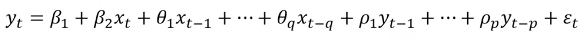
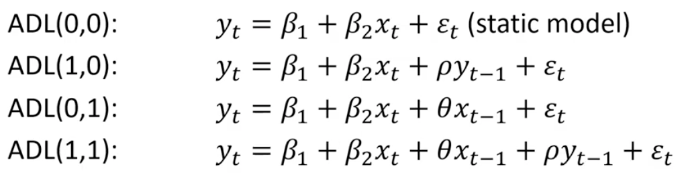

**Vector Auto Regression (VAR)** in levels just means without taking any differences of the data. If your data in levels (i.e. as-is without any differencing) is 𝐼(𝑑), then first-differencing will make your data 𝐼(𝑑−1), and thus differencing 𝑑 times will make the data 𝐼(0). Often times we estimate VAR in differences to make the data 𝐼(0), so that we can work with stationary data. The appropriate specification, if your data are 𝐼(1), will depend heavily on whether the series are cointegrated.

**Unit Root** A unit root (also called a unit root process or a difference stationary process) is a stochastic trend in a time series, sometimes called a “random walk with drift”; If a time series has a unit root, it shows a systematic pattern that is unpredictable. https://www.statisticshowto.com/unit-root/

The existence of unit roots can cause your regression analysis to have serious issues like:
- Spurious regressions: you could get high r-squared values even if the data is uncorrelated.
- Errant behavior due to assumptions for analysis not being valid. For example, t-ratios will not follow a t-distribution.

Unit root tests are tests for stationarity in a time series. A time series has stationarity if a shift in time doesn’t cause a change in the shape of the distribution; unit roots are one cause for non-stationarity.

- The Dickey Fuller Test (sometimes called a Dickey Pantula test), which is based on linear regression. Serial correlation can be an issue, in which case the Augmented Dickey-Fuller (ADF) test can be used. The ADF handles bigger, more complex models. It does have the downside of a fairly high Type I error rate.

> Stephanie Glen. "Unit Root: Simple Definition, Unit Root Tests" From StatisticsHowTo.com: Elementary Statistics for the rest of us! https://www.statisticshowto.com/unit-root/

**Delivery Month Futures Code:**
January = F, February = G, March = H, April = J, May = K, June = M, July = N, August = Q, September = U, October = V, November = X, December = Z

**Autoregresive-Distributed lag (ADL) model**

ADL(p,q)

p is called the lag length of the dependent variable
q is called the lag length of the explanatory variable

Common ADL models

**Asymptotic normality** is a property of an estimator. “Asymptotic” refers to how an estimator behaves as the sample size gets larger (i.e. tends to infinity). “Normality” refers to the normal distribution, so an estimator that is asymptotically normal will have an approximately normal distribution as the sample size gets infinitely large. Asymptotic normality is very similar to the **Central Limit Theorem**. So similar in fact, that the two are (in general terms) the same thing. However, the CLT is a theorem, one that states:

**t-test** is a type of inferential statistic used to determine if there is a significant difference between the means of two groups, which may be related in certain features. It is mostly used when the data sets would follow a normal distribution and may have unknown variances. A t-test is used as a hypothesis testing tool, which allows testing of an assumption applicable to a population. 

**Watson Statistic** (DW) statistic is a test for autocorrelation in the residuals from a statistical regression analysis. The Durbin-Watson statistic will always have a value between 0 and 4. A value of 2.0 means that there is no autocorrelation detected in the sample. Values from 0 to less than 2 indicate positive autocorrelation and values from from 2 to 4 indicate negative autocorrelation.