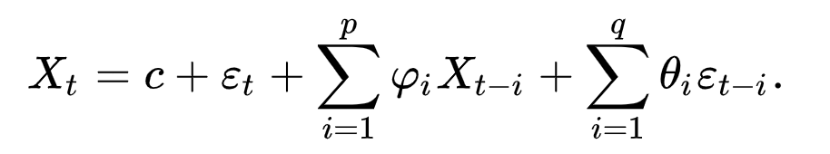
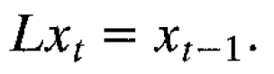
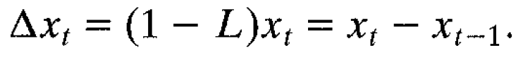

**Vector Auto Regression (VAR)** in levels just means without taking any differences of the data. If your data in levels (i.e. as-is without any differencing) is 𝐼(𝑑), then first-differencing will make your data 𝐼(𝑑−1), and thus differencing 𝑑 times will make the data 𝐼(0). Often times we estimate VAR in differences to make the data 𝐼(0), so that we can work with stationary data. The appropriate specification, if your data are 𝐼(1), will depend heavily on whether the series are cointegrated.

**Unit Root** A unit root (also called a unit root process or a difference stationary process) is a stochastic trend in a time series, sometimes called a “random walk with drift”; If a time series has a unit root, it shows a systematic pattern that is unpredictable. https://www.statisticshowto.com/unit-root/

The existence of unit roots can cause your regression analysis to have serious issues like:
- Spurious regressions: you could get high r-squared values even if the data is uncorrelated.
- Errant behavior due to assumptions for analysis not being valid. For example, t-ratios will not follow a t-distribution.

Unit root tests are tests for stationarity in a time series. A time series has stationarity if a shift in time doesn’t cause a change in the shape of the distribution; unit roots are one cause for non-stationarity.

- The Dickey Fuller Test (sometimes called a Dickey Pantula test), which is based on linear regression. Serial correlation can be an issue, in which case the Augmented Dickey-Fuller (ADF) test can be used. The ADF handles bigger, more complex models. It does have the downside of a fairly high Type I error rate.

> Stephanie Glen. "Unit Root: Simple Definition, Unit Root Tests" From StatisticsHowTo.com: Elementary Statistics for the rest of us! https://www.statisticshowto.com/unit-root/

**Delivery Month Futures Code:**
January = F, February = G, March = H, April = J, May = K, June = M, July = N, August = Q, September = U, October = V, November = X, December = Z

**Autoregresive-Distributed lag (ADL) model**

ADL(p,q)

p is called the lag length of the dependent variable
q is called the lag length of the explanatory variable

Common ADL models

**Asymptotic normality** is a property of an estimator. “Asymptotic” refers to how an estimator behaves as the sample size gets larger (i.e. tends to infinity). “Normality” refers to the normal distribution, so an estimator that is asymptotically normal will have an approximately normal distribution as the sample size gets infinitely large. Asymptotic normality is very similar to the **Central Limit Theorem**. So similar in fact, that the two are (in general terms) the same thing. However, the CLT is a theorem, one that states:

**t-test** is a type of inferential statistic used to determine if there is a significant difference between the means of two groups, which may be related in certain features. It is mostly used when the data sets would follow a normal distribution and may have unknown variances. A t-test is used as a hypothesis testing tool, which allows testing of an assumption applicable to a population. 

**Watson Statistic** (DW) statistic is a test for autocorrelation in the residuals from a statistical regression analysis. The Durbin-Watson statistic will always have a value between 0 and 4. A value of 2.0 means that there is no autocorrelation detected in the sample. Values from 0 to less than 2 indicate positive autocorrelation and values from from 2 to 4 indicate negative autocorrelation.

**autoregressive–moving-average (ARMA)** models provide a description of a stationary stochastic process in terms of two polynomials, one for the autoregression (AR) and the second for the moving average (MA). The notation ARMA(p, q) refers to the model with p autoregressive terms and q moving-average terms. This model contains the AR(p) and MA(q) models,

**Ergodicity, uniform mixing, and strong mixing** are three types of asymptotic independence, implying that two realizations of a time series become ever closer to independence as the distance between them increases. **Ergodicity** is a weak form of average asymptotic independence, and usually we will assume that stronger conditions hold which imply ergodicity. **Uniform mixing** implies **strong mixing**, and for a stationary process either of these implies **ergodicity**.

Informally, a series is said to be **integrated** if it accumulates some past effects; such a series is non-stationary because its future path depends upon all such past influences, and is not tied to some mean to which it must eventually return.

Lag operator

First Difference operator

**Isomorphic representations** are, for practical purposes, "the same"; they provide the same information about the group or algebra being represented. Representation theory therefore seeks to classify representations up to isomorphism.

**The Akaike information criterion (AIC)** is a mathematical method for evaluating how well a model fits the data it was generated from. In statistics, AIC is used to compare different possible models and determine which one is the best fit for the data.